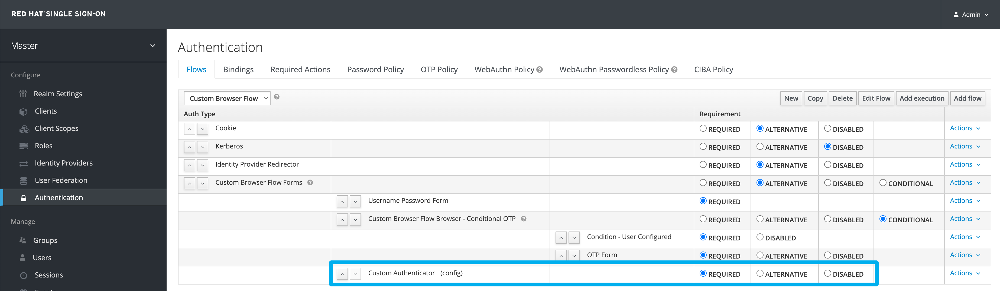
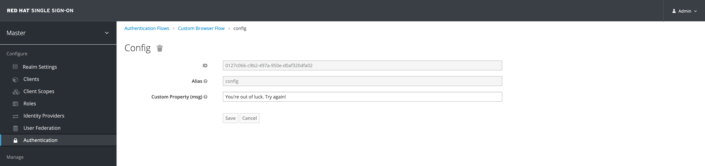
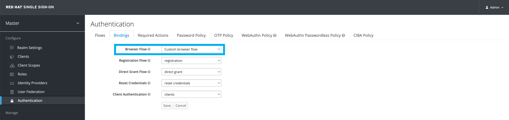

# Custom Authenticator for Keycloak

A custom base authenticator for keycloak.

You should need to:

1. make a copy of `browser` authenticator flow and add this authenticator 
as new execution at `Custom Browser Flow Forms`

2. create a config for this execution with some alias

3. Config this new flow to be used as browser flow at realm or your client

