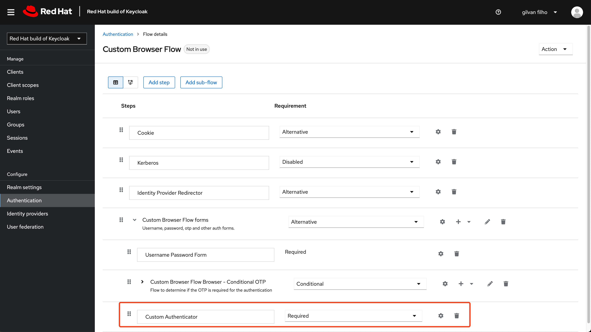
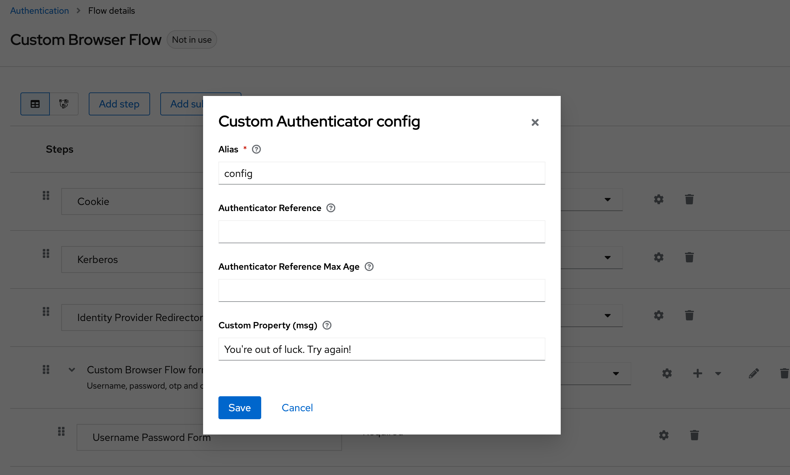
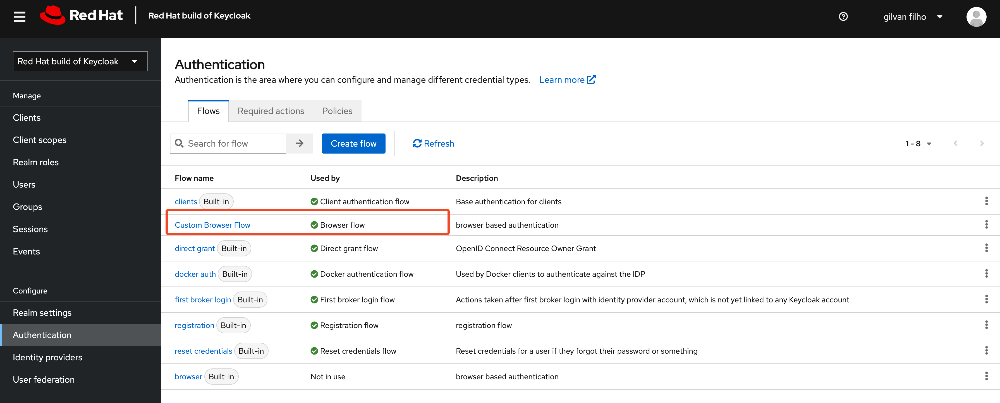

# Custom Authenticator for Keycloak

A custom base authenticator for Red Hat Build of Keycloak.

> To use with the  upstream(community) version, update the dependencies in pom.xml

Build the package
```
mvn clean package
```

Copy the generated jar file (`./target/keycloak-custom-authenticator-1.0.0.jar`) to `{rhbk_home}/providers` folder.

To configure, after start keycloak should need to:

1. make a copy (duplicate) of `browser` authenticator flow and add this authenticator 
as new execution at `Custom Browser Flow Forms`



2. Create a config for this execution with some alias



3. Config this new flow to be used as browser flow at realm or your client

